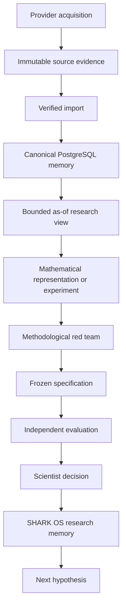
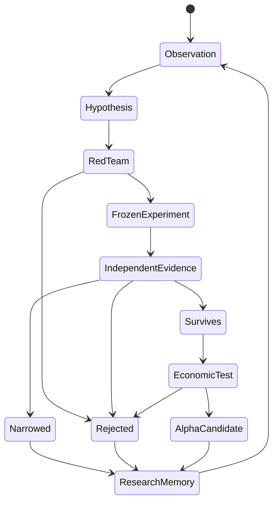

# SHARK Architecture

## Research architecture objective

SHARK separates acquisition evidence, canonical memory, point-in-time research views, mathematical computation, methodological validation, scientific decisions, and research memory.

The purpose of that separation is to preserve causal information boundaries and make the scientific state of the programme reconstructable after individual experiments have succeeded, failed, or changed interpretation.

## Research flow



## Evidence plane

Raw acquisition artifacts are preserved as immutable evidence with content hashes, provider metadata, bounded timestamps, and source identity. Historical evidence is not rewritten when canonical memory is rebuilt or a scientific interpretation changes.

Canonical bars retain provenance back to the evidence that produced them. Conflicting historical observations fail closed rather than silently replacing prior state.

## Canonical memory

PostgreSQL is the supported market-data research interface.

The intraday laboratory distinguishes a frozen baseline corpus from later incremental publications. Complete-through boundaries provide a synchronized point at which cross-sectional experiments can reason about a common publication horizon.

The current 5-minute corpus and the daily Pattern Engine are separate scientific surfaces. Daily detector contracts do not automatically acquire authority over intraday data, and intraday experiments do not silently inherit claims from the detector system.

## Point-in-time readers

Experiments consume bounded research views rather than arbitrary source files.

The reader surface supports:

- one-symbol bounded windows
- versioned-universe windows
- exact-timestamp cross sections
- bounded or streaming large scans

A research calculation receives only information available inside its declared boundary. An unavailable horizon provides no market-data authority rather than an empty structure that can later be populated accidentally.

## Versioned universe

Universe membership is an identified research object. Experiments bind to an exact universe version rather than a mutable ticker list.

This does not by itself eliminate historical survivorship bias. A point-in-time 2026 universe applied to earlier bars remains a study of the historical paths of names selected in 2026. SHARK records that limitation explicitly instead of relabeling the panel as contemporaneous historical membership.

## Mathematical layer

SHARK uses typed, deterministic mathematical components and bounded specialist tooling rather than notebook state as research authority.

The current system includes sequence and geometric representations, retrospective and cross-sectional interrogation, permutation and bootstrap procedures, deterministic randomization, and experiment-specific statistical machinery.

Methods are selected by the scientific question. Existing research is used as prior art and as a source of baselines, numerical references, and adversarial comparisons.

## Detection and evaluation boundary

Discovery and evaluation are different operations.

A detector or experiment consumes only its permitted information at cutoff `T`. Retrospective evaluation may inspect what happened after `T` once the candidate is fixed, but future observations cannot alter what the original calculation saw.

```text
discovery sample
-> candidate or state
-> freeze claim
-> independent evaluation
-> reject | narrow | survive
```

A discovery result cannot become validated merely because it is strong in the sample that produced it.

## SHARK OS research memory

Scientific state is represented independently from market data.

SHARK OS stores six Git-native object classes:

```text
Hypothesis
Experiment
Result
Lesson
Branch
EvidenceExposure
```

This preserves distinctions that are easy to lose in prose:

- machine verdict versus scientist acceptance
- provisional result versus final scientific conclusion
- evidence first seen as confirmation versus evidence later reused for forensics
- a statement ruled out by evidence versus a question that was never tested
- a closed branch versus the conditions under which it could legitimately reopen

A deterministic Context Pack reconstructs relevant prior state before new research advances. It uses exact graph relationships rather than semantic inference.

The repository-wide scientific verifier fails closed when the memory graph is invalid, evidence authority is inconsistent, or frozen experiment identity has changed.

## Research lifecycle



The architecture is intentionally optimized for correction and rejection. A failed experiment is useful when it removes an unpromising branch, preserves the reason, and prevents the same evidence or mistake from being presented later as new support.
