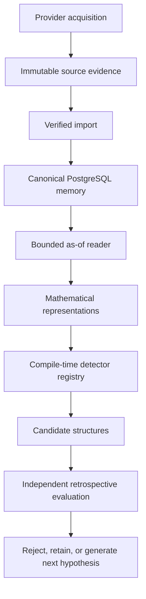
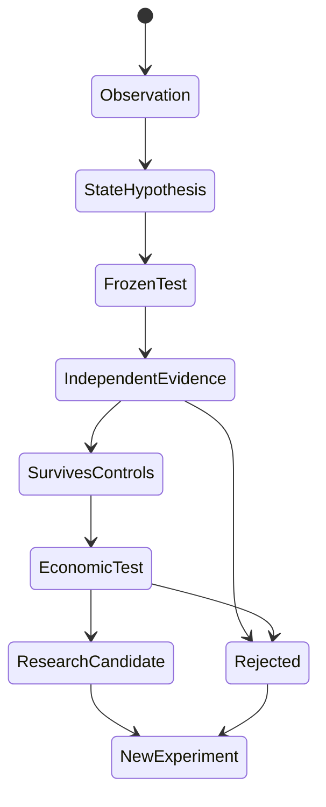

# SHARK Architecture

## Research architecture objective

SHARK separates acquisition evidence, canonical memory, point-in-time research views, candidate generation, and retrospective evaluation. That separation is meant to preserve causal information boundaries while still allowing historical time to be compressed for research.

## Data flow

## Evidence plane

Raw acquisition artifacts are preserved as immutable evidence with content hashes, byte-level identity, provider metadata, and bounded timestamps. Historical evidence is not overwritten when canonical memory is rebuilt.

## Canonical memory

PostgreSQL is the supported research interface. Canonical tables preserve source-evidence references so a derived bar can be traced back to its acquisition artifact.

The system distinguishes a frozen baseline corpus from later incremental publications. Complete-through boundaries provide a synchronized point at which cross-sectional experiments can safely assume the same publication horizon across the universe.

## Research readers

Experiments consume bounded readers rather than arbitrary raw-file access. The reader surface supports:

- one-symbol windows
- versioned universe windows
- exact-timestamp cross sections
- streaming folds for large scans

This limits accidental leakage and prevents research code from silently substituting a different data source.

## Point-in-time universe

Universe membership is versioned. Research queries identify the exact universe version rather than treating a name as a mutable alias. This reduces look-ahead and membership ambiguity.

## Detector boundary

Detection and evaluation are separate operations. A detector consumes only information available at the specified `as_of` boundary. Retrospective replay can then inspect what happened later, but future observations cannot alter the candidate the detector originally produced.

## Research lifecycle

The system is intentionally optimized for fast rejection. A failed experiment is considered useful when it removes an unpromising branch without contaminating later evidence.
