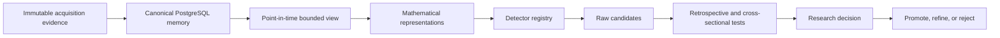

# SHARK

## Causal, reproducible quantitative research infrastructure

SHARK is a short-horizon mathematical pattern-discovery laboratory for liquid U.S. equities. Its operating principle is simple: research velocity matters only when the evidence remains causal, reproducible, and resistant to self-deception.

The implementation and research history remain private. This case study presents the laboratory architecture, experimental rules, corrections, and current research record.

## My role

I own the research thesis, experimental rules, information boundaries, architecture constraints, acceptance criteria, and research decisions for SHARK. I review implementation and evidence against those rules, including whether a result is promoted, rejected, or sent back for another experiment. AI-assisted engineering tools are part of the build workflow; scientific authority remains with the frozen specification and immutable result bundle.

**Period:** active quantitative research program, August 2026.  
**Current status:** the canonical research laboratory is operational locally, the 200-equity intraday corpus is frozen in PostgreSQL, the OCaml pattern engine and retrospective proof system are executable, and the first frozen state experiment has completed. The system is research infrastructure, not a production trading stack.

## Research problem

Quantitative research can fail long before a model is wrong. Common failure modes include look-ahead leakage, specification changes after seeing validation results, survivorship or universe bias, repeated testing against the same evidence, weak null models, provenance loss, and treating a successful backtest as a tradable strategy.

SHARK treats those as architecture and experimental-design problems rather than footnotes.

## Current laboratory

The canonical intraday environment currently contains:

- **200 liquid U.S. equities** in a versioned research universe
- approximately **720 calendar days** of history
- native **5-minute bars**
- **7,659,672 frozen regular-session baseline bars**
- Alpaca SIP historical data as acquisition evidence
- PostgreSQL as canonical research memory
- immutable source evidence with content hashes and provenance

The pattern engine currently ships **three built-in detector families**: directional n-grams, turning-angle structure, and triangle/path-ratio geometry. Its accepted retrospective gate records **508 passing tests**, including **152 native PostgreSQL tests** and **174 focused Pattern Engine Room tests**.

## System shape



The detector sees only information available at its research timestamp. Retrospective evaluation can inspect the already-known future afterward, but cannot alter what the detector originally observed.

## Research rules

### Frozen tests

A theory-driven experiment freezes the observable, transformation, statistic, horizon, information set, null, and acceptance rule before validation or holdout results are inspected. Changing one of those after inspection creates a new experiment.

### State before prediction

The preferred sequence is:

```text
observable
-> causal state reconstruction
-> state existence
-> state persistence
-> simpler controls
-> hostile null tests
-> prediction
```

Prediction can be tested earlier, but it does not substitute for evidence that the underlying state exists.

### Economic validation comes later

Statistical structure is not called trading alpha merely because a statistic is significant. A later strategy must survive the frictions relevant to its implementation, such as spread, slippage, latency, market impact, borrow, option liquidity, carry, hedging, and execution delay.

### Methods are subordinate to the question

The current engine uses concrete geometric and sequence representations, cross-sectional and retrospective interrogation, permutation and bootstrap tests, and deterministic fingerprints. New mathematical methods are useful only when their assumptions and information boundaries are explicit and the resulting claim is falsifiable.

## A completed experiment

The first completed frozen state experiment, `O0-MA-5M-MAGNITUDE-ACTIVITY-STRUCTURE-v1`, asked whether magnitude and activity carry persistent within-session structure and whether their joint state contains incremental information beyond the two marginals.

The accepted run used:

- **13 symbols**, including AAPL plus 12 deterministic selections from the 200-equity universe
- **120 sessions per symbol**, split into 60 train, 30 confirmation, and 30 final-holdout sessions
- native 5-minute bars, **78 slots per session**
- lags from **5 to 60 minutes**
- **5,000 permutation/null replicates** and **10,000 cluster-bootstrap replicates** at the relevant stages
- a fresh immutable result bundle with deterministic worker-independent RNG

The result was mixed:

> **`PASS_PRIMITIVE_PERSISTENCE_ONLY`**

On final holdout, clock-normalized absolute return magnitude, log volume, and log trade count each showed positive persistence at 20 to 60 minute lags. At the smallest qualifying lag, all 13 symbols agreed in sign. Activity persistence was much larger than magnitude persistence.

The stronger joint-state hypothesis did **not** pass. Across both magnitude×volume and magnitude×trade-count families, **0 of 24 family-lag tests qualified** after the frozen circular-displacement null and multiple-testing correction. The smallest adjusted q-value was 0.175, above the pre-registered 0.05 gate.

That negative result remains the result. The experiment was not rewritten to promote the joint state.

## Corrections before the accepted run

The experiment records implementation errors discovered before scientific output existed. A few examples:

- a bootstrap implementation accidentally collapsed repeated session draws, invalidating the intended cluster resampling
- an RNG scheme based on name lengths could collide across equal-length symbols
- canonical-complete-through metadata could silently default in a way that allowed an incomplete database to look acceptable
- a Stage B weighting path could fall back to uniform weights because the wrong session list was supplied
- the first sequential implementation was projected at roughly 183 hours; removing redundant computation and using eight workers reduced the accepted run to about **22 minutes** without changing the frozen statistic

Each correction was made before Stage A or Stage B scientific statistics were visible. The accepted record reports **no post-result scientific adaptation**.

## Canonical data architecture

Raw acquisition artifacts are immutable evidence. Researchers normally work through PostgreSQL rather than reparsing source files.

Each canonical bar can be traced to the evidence object that produced it. Re-importing identical evidence is a no-op. Conflicting historical OHLC or volume observations fail closed rather than silently rewriting the past.

The universe is also an identified object. An experiment binds to an exact universe version instead of inheriting whatever ticker list happens to be current later.

## Why OCaml

The canonical research core uses OCaml 5.2+, Dune, Caqti, Lwt, Lacaml, Domainslib, Yojson, and OUnit. The choice is practical: explicit types help encode information boundaries and state transitions, detector registration is compile-time controlled, and the research engine stays separate from ad hoc notebook state. Python remains available where provider or scientific tooling makes it the better boundary language.

## Current boundary

SHARK has a real data corpus, executable research engine, frozen experiments, retrospective proofs, and a completed first state experiment. The completed experiment establishes primitive magnitude and activity persistence within its frozen window; it does not establish signed-return predictability, executable alpha, profitability, or production trading authority.

The durable asset is the research process: a result can survive, fail, or close a branch without changing the evidence after the fact.

[Architecture](ARCHITECTURE.md) · [Technical decisions](TECHNICAL_DECISIONS.md) · [Validation](VALIDATION.md) · [Back to profile](https://github.com/Andy11-cpu)
