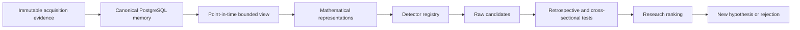

# SHARK

## Causal, reproducible quantitative research infrastructure

SHARK is a short-horizon mathematical pattern-discovery laboratory for liquid U.S. equities. The project is designed around one principle: research velocity only matters if the evidence remains causal, reproducible, and resistant to self-deception.

The private repository contains the implementation and research history. This public case study documents the architecture, experimental discipline, and current research surface without publishing proprietary source code, raw market data, internal research logs, or live-trading logic.

## Research problem

Quantitative research can fail long before a model is wrong. Common failure modes include:

- look-ahead leakage
- specification changes after seeing validation results
- survivorship or universe bias
- repeated testing against the same evidence
- treating statistical predictability as executable alpha
- losing provenance between raw data and derived results
- confusing a successful backtest with a production trading system

SHARK treats those as architecture problems rather than footnotes.

## Current laboratory

The canonical intraday research environment currently contains:

- 200 liquid U.S. equities in a fixed research universe
- approximately 720 calendar days of history
- native 5-minute bars
- 7,659,672 frozen regular-session baseline bars
- Alpaca historical SIP data as acquisition evidence
- PostgreSQL as canonical research memory
- immutable source evidence with content hashes and provenance

The system is research infrastructure. It does not claim a profitable strategy, execution authority, or investment recommendation.

## System shape



The detector only sees information available at its research timestamp. Evaluation can inspect the already-known future afterward, but it cannot change what the detector originally observed.

## Research constitution

### Data has veto authority

A pattern is not rescued by repeatedly changing thresholds, horizons, samples, or transformations after validation evidence has been inspected. If a theory-driven test fails, the default result is rejection.

A new specification becomes a new experiment.

### Establish state before prediction

The preferred sequence is:

```text
observable
-> causal state reconstruction
-> state existence
-> state persistence
-> simpler controls
-> hostile null tests
-> prediction
```

This reduces the risk of optimizing a prediction target before establishing that the underlying market state is real and persistent enough to matter.

### Statistical structure is not automatically alpha

A result must survive relevant economic frictions before it deserves to be called trading alpha. Depending on the strategy, that can include spread, slippage, latency, market impact, borrow, option liquidity, carry, model error, and execution delay.

### Mathematics is a tool, not an ideology

The research program is free to combine methods from geometry, stochastic processes, information theory, topology, optimal transport, spectral analysis, econometrics, control theory, and other compatible fields. Novel constructions are acceptable when assumptions are explicit, operations are valid, information boundaries are causal, and claims remain falsifiable.

## Canonical data architecture

Raw acquisition artifacts are immutable evidence. Researchers normally work through PostgreSQL rather than reparsing raw files.

Each canonical bar can be traced back to the evidence object that produced it. Re-importing identical evidence is a no-op. Conflicting historical observations fail closed rather than silently overwriting the past.

The research universe is versioned explicitly. A universe identifier never silently means whatever membership happens to be current at query time.

## Technology

The private implementation uses:

- OCaml 5.2+
- Dune
- PostgreSQL
- Caqti
- Lwt
- Lacaml
- Domainslib
- Yojson
- OUnit
- Python only where needed around provider acquisition or external tooling

The project deliberately prefers a strongly typed research core and keeps data acquisition evidence separate from canonical analytical memory.

## Why OCaml

OCaml is not used as aesthetic signaling. It is useful here because the research system benefits from:

- explicit types for information boundaries and state transitions
- compile-time detector registration
- functional decomposition of mathematical transformations
- predictable native execution
- a smaller runtime surface than a notebook-first research stack

Python and R remain available where their scientific ecosystems are materially stronger, but the canonical engine is not designed around ad hoc notebooks.

## Current boundary

SHARK is an active research laboratory. Its present outputs are mathematical candidates and empirical findings, not production trading instructions. Research hypotheses, models, and individual alphas are intentionally disposable. The durable asset is the process that can generate, test, reject, and replace them without corrupting the evidence base.

## What this case study demonstrates

The project is primarily about scientific discipline under adversarial data. The central question is not whether a model can fit market history. It is whether a claimed state existed at the time, survived hostile controls, remained economically relevant, and can be reproduced from sealed evidence.

[Architecture](ARCHITECTURE.md) · [Technical decisions](TECHNICAL_DECISIONS.md) · [Validation](VALIDATION.md) · [Back to profile](https://github.com/Andy11-cpu)
